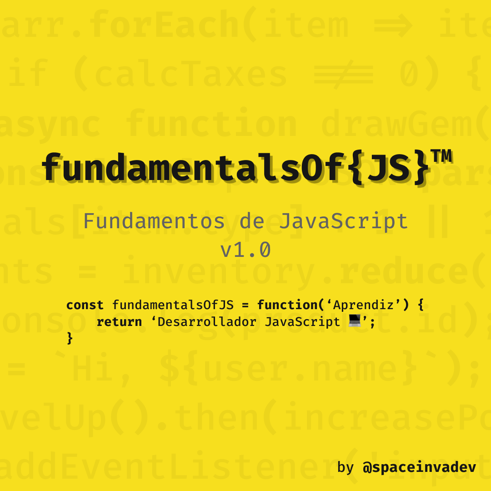

# fundamentalsOf{JS}™ - Fundamentos de JavaScript

Este es un curso introductorio al lenguaje JavaScript. Este proyecto refleja el camino que recorrí para llegar a ser un desarrollador de JavaScript. Referencio múltiples fuentes para complementar la información. He decidido compartir esto con todos como un punto de entrada al mundo de JavaScript para todas aquellas personas que desean unirse a nosotros.

Tu retroalimentación y sugerencias son bienvenidas. Siéntete libre de enviar la tuya mediante Pull Request.

## Contenido

### 1. Introducción a JavaScript

#### 1.1 ¿Qué es JavaScript?

#### 1.2 Manuales y especificaciones

#### 1.3 Editores de código

#### 1.4 Herramientas de desarrollador del navegador (Developer Tools)

### 2. JavaScript: Lo fundamental

### 10. Recursos adicionales