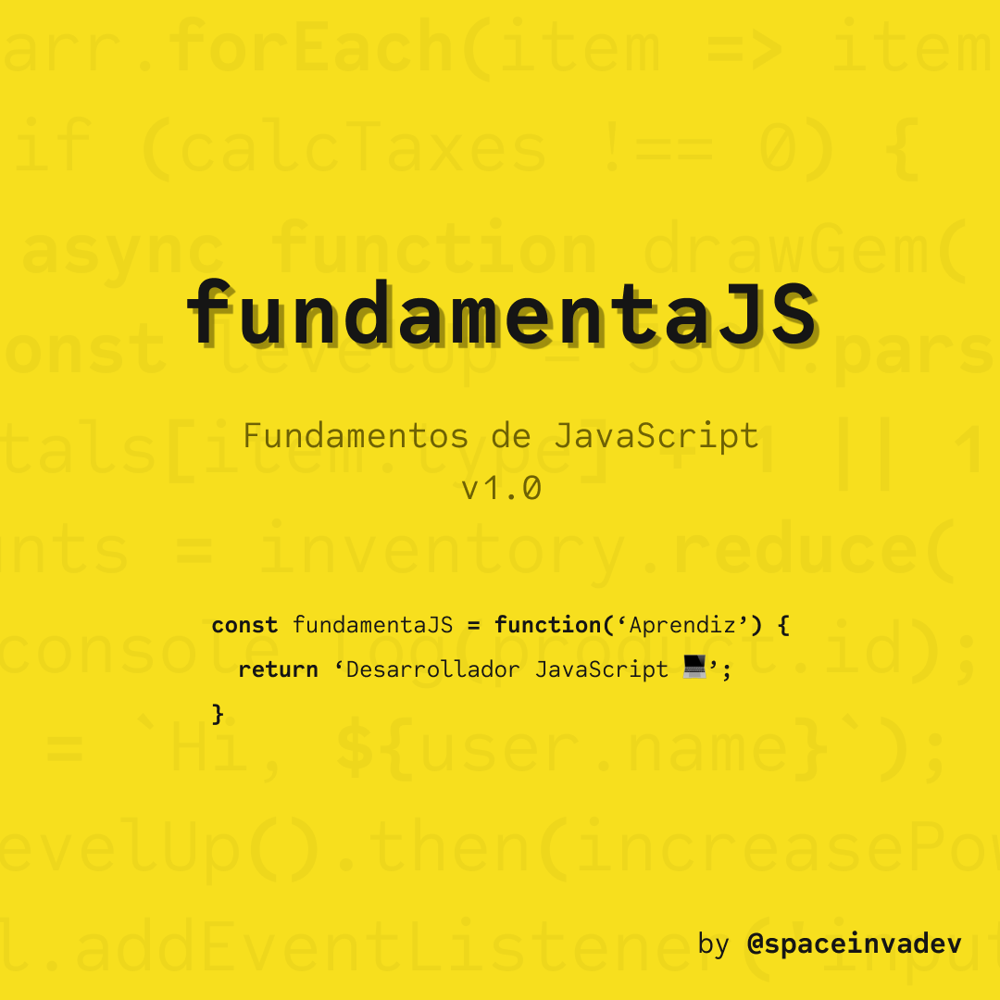

# fundamentaJS: Fundamentos de JavaScript

Bienvenidos a fundamentaJS, un curso introductorio sobre JavaScript. Este proyecto comenzó mientras aprendía el lenguaje JavaScript. Decidí documentar mi proceso de aprendizaje y compartirlo públicamente como un punto de entrada al mundo de JavaScript para todas aquellas personas que deseen aprender el lenguaje. He referenciado múltiples fuentes para complementar la información.

Cualquier comentario y sugerencia son bienvenidos. Siéntete libre de enviar el tuyo a través de _Pull Request_.

## Contenido

### 1. [Introducción a JavaScript](/introduccion/intro.md)

#### 1.1 ¿Qué es JavaScript?

#### 1.2 Manuales y especificaciones

#### 1.3 Editores de código

#### 1.4 Herramientas de desarrollador del navegador (Developer Tools)

### 2. JavaScript: Lo fundamental

### 10. Recursos adicionales